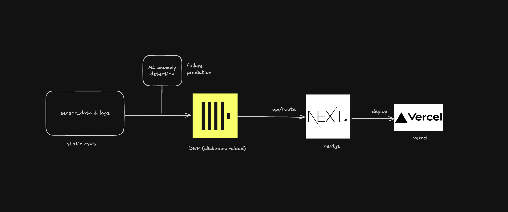
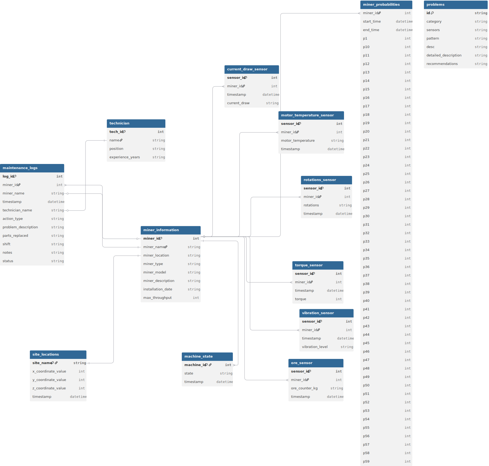

# Miner-BI

### BI-система мониторинга буровых установок для анализа сенсорных данных, предиктивного обслуживания и отслеживания эффективности добычи.

Ознакомиться с рабочей версией можно вот тут: https://miner-bi.vercel.app/

---

Вы - главный инженер на удалённом руднике.
Ваша прямая ответственность - добыча руды и бесперебойная работа буровых установок.

Вы не можете одновременно быть рядом с и следить за каждой установкой по отдельности, и вручную взвешивать добытую ими руду.

На удалённом руднике десятки буровых установок.
Отсутствует централизованный мониторинг.
Вы не видите поломки заранее.
Отсутствует аналитика производства.

И поэтому, для оперативного принятия решений, отчётности и анализа добытых ресурсов была поставлена задача — разработка **BI системы**, которая позволит:

1. Отслеживать работу каждой буровой установки.
2. Получать информацию о состоянии оборудования для своевременного вмешательства.
3. Анализировать эффективность работы во времени.
4. Видеть записи проверок, поломок.
5. Предсказывать потенциальные проблемы.

> В условиях большого числа буровых установок и отсутствия централизованного мониторинга, инженеру крайне сложно отслеживать состояние оборудования вручную и предотвращать поломки. Система решает эти задачи.

---

#### Архитектура системы:

Выбранный стек для задачи: clickhouse и nextjs.

Система построена по принципу:

Сенсор → База данных → Аналитика → Визуализация

Все данные хранятся в статических CSV-файлах (потенциально можно сделать real-time поток).

#### ER-диаграмма

Сенсорные данные находятся в time-series таблицах:

**ore_sensor, torque_sensor, vibration_sensor, rotations_sensor, motor_temperature_sensor, current_draw_sensor и machine_state**

Измерения происходили раз в 10 минут каждым сенсором.
Эти таблицы сязаны с таблицей miner_information и явяляются основными данными на которых работает эта система.

**site_locations** - описывающая таблица с информацией о месторождениях.

**maintenance_logs** - исторические записи решения проблем и проведения физических проверок на буровых установках.
**technician** - нормализованная часть таблицы записей, содержит информацию о работающих инженерах.

**miner_probabilities** - таблица вероятностей предсказанных мл моделью для каждой проблемы.
**problems** - углубленная информация о каждой возможной проблеме, предсказываемой моделью.

#### ML модель

Для предсказания проблем использовался RandomForest.

Jupyter notebook: [ML/ml.ipynb](https://github.com/lwoitr/MinerBI/blob/main/ML/ml.ipynb)

Модель обучалась на сгенерированных данных сенсоров.
